## BUG-001 — [Authentication] Login succeeds with blank, partial, or whitespace-only credentials

* **Severity:** Critical
* **Priority:** High
* **Status:** Open

### Summary

The application allows users to access the Product Inventory dashboard without providing complete and valid login credentials.

### Description

The login form does not correctly validate the email and password before granting access. Submitting blank fields, only one credential, or whitespace-only values redirects the user to the protected dashboard.

### Environment

* **Application:** Product Inventory Application
* **Environment:** QA
* **URL:** `https://qa-takehome-app.onrender.com/index.html`

### Preconditions

1. The user is logged out.
2. The login page is open.
3. Use a new browser session or Incognito window to ensure that no previous authentication state exists.

### Test data

| Scenario               | Email            | Password      |
| ---------------------- | ---------------- | ------------- |
| Both fields empty      | Blank            | Blank         |
| Password missing       | `admin@test.com` | Blank         |
| Email missing          | Blank            | `password123` |
| Whitespace-only values | Spaces only      | Spaces only   |

### Steps to reproduce

1. Navigate to the login page.
2. Enter one of the credential combinations shown in the test-data table.
3. Select **Login**.
4. Observe the page displayed after submission.
5. Repeat the steps for each credential combination.

### Actual result

The application accepts blank, incomplete or whitespace-only credentials and redirects the unauthenticated user to the Product Inventory dashboard.

### Expected result

The application should:

* Reject blank, incomplete and whitespace-only credentials.
* Keep the user on the login page.
* Display clear validation messages for the required fields.
* Prevent the user from directly accessing the dashboard without successful authentication.

### User and business impact

An unauthenticated user can bypass the login control and access functionality intended for an authenticated administrator. If product-management actions are also available, the user could view, create, edit or delete inventory records without authorization. This compromises the confidentiality and integrity of the inventory data.

### Evidence

**Figure 1 — Login form submitted with both credential fields empty**

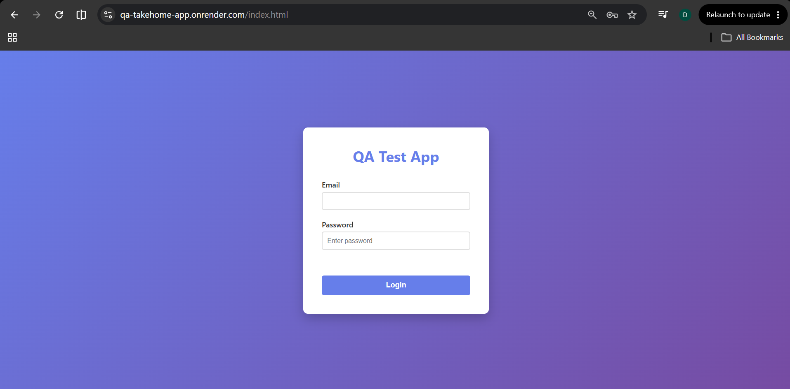

**Figure 2 — Protected dashboard displayed after submitting blank credentials**

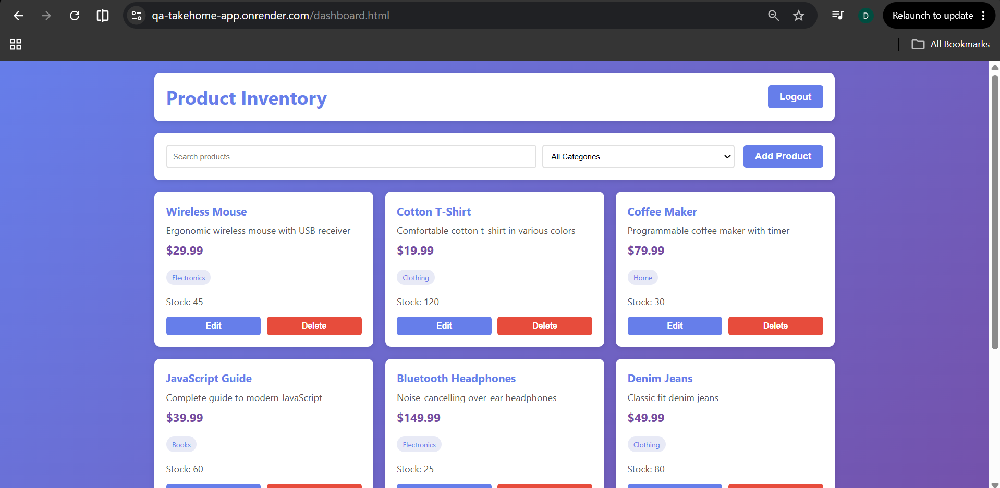

**Note:** The screenshots above demonstrate only the both-fields-empty scenario.
The remaining credential combinations were also reproduced manually.

## BUG-002 — [Session Management] Logged-out user can return to the protected dashboard using the browser Back button

* **Severity:** High
* **Priority:** High 
* **Status:** Open
 

### Summary

After logging out, the user can use the browser Back button to return to the Product Inventory dashboard.

### Description

The logout process redirects the user to the login page, but the previously protected dashboard remains accessible through browser history. Product information and management controls are displayed even though the user has logged out.

This indicates that the application may not be completely invalidating the authenticated session or preventing protected dashboard content from being restored from the browser cache.

### Environment

* **Application:** Product Inventory Application
* **Environment:** QA
* **Login URL:** `https://qa-takehome-app.onrender.com/index.html`
* **Protected URL:** `https://qa-takehome-app.onrender.com/dashboard.html`
 

### Preconditions

1. The user has valid administrator credentials.
2. The user is logged out before beginning the test.
3. Use a new browser session or Incognito window to avoid interference from an earlier session.

### Test data

| Field    | Value            |
| -------- | ---------------- |
| Email    | `admin@test.com` |
| Password | `password123`    |

### Steps to reproduce

1. Navigate to the login page.
2. Enter valid administrator credentials.
3. Select **Login**.
4. Confirm that the Product Inventory dashboard is displayed.
5. Select **Logout**.
6. Confirm that the application redirects to the login page.
7. Select the browser **Back** button.
8. Observe the page displayed.

### Actual result

The Product Inventory dashboard is displayed again after the user selects the browser Back button. Product information and product-management controls remain visible even though the user previously logged out.

### Expected result

After logout, the application should:

* Completely invalidate the authenticated session.
* Prevent protected dashboard content from being displayed through browser history.
* Keep the user on the login page or redirect them to it.
* Require the user to authenticate again before accessing the dashboard or performing product-management actions.

### User and business impact

On a shared or unattended device, another person could view protected inventory information after the authenticated user logs out. If the restored dashboard remains functional, the person may also be able to create, edit or delete inventory records without authenticating, compromising inventory confidentiality and integrity.

### Evidence

**Figure 1 — Dashboard displayed while the user is authenticated**

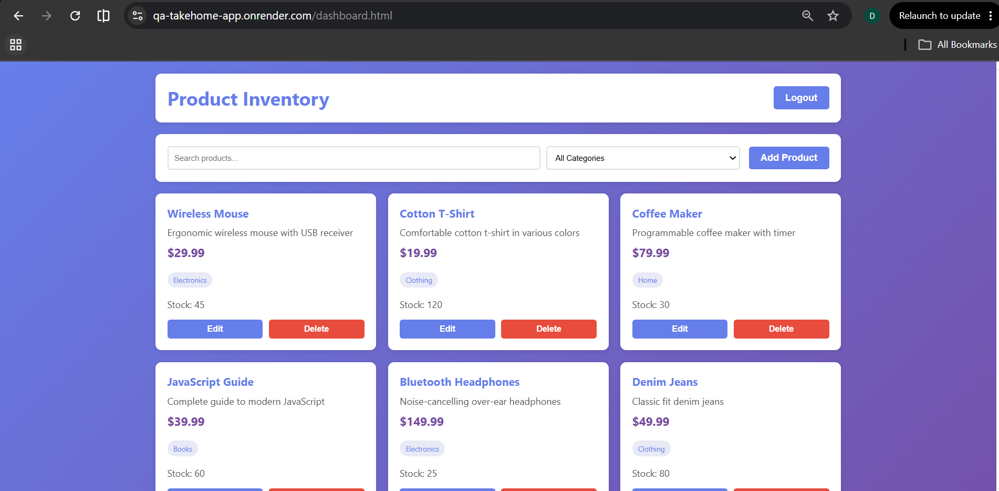

**Figure 2 — Application redirects to the login page after Logout is selected**

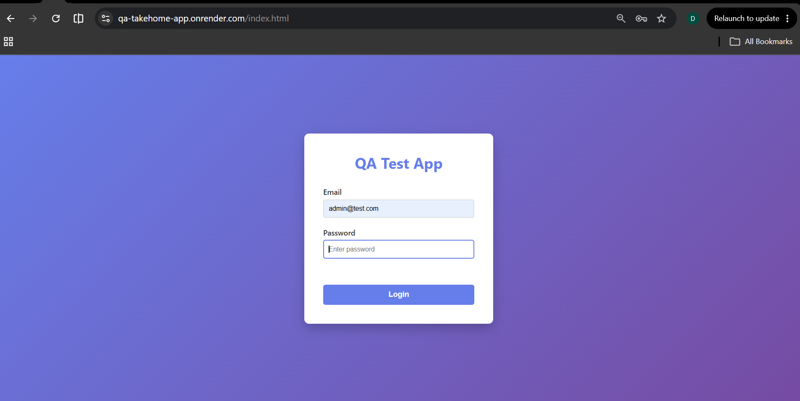

**Figure 3 — Protected dashboard reappears after selecting the browser Back button**

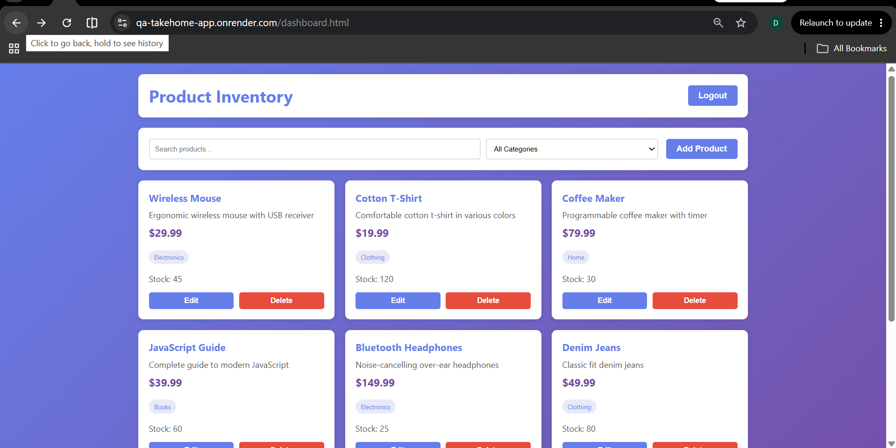

 ## BUG-003 — [Product Editing] Saving product changes creates a duplicate instead of updating the original product

 

* **Severity:** High
* **Priority:** High  
* **Status:** Open
 
### Summary

Editing an existing product creates a second product card instead of updating the original product.

### Description

When an administrator opens an existing product, changes its information and saves the changes, the application adds a new product card containing the updated information. The original product remains unchanged in the inventory.

This increases the number of inventory records and creates duplicate or conflicting product information.

### Environment

* **Application:** Product Inventory Application
* **Environment:** QA
* **URL:** `https://qa-takehome-app.onrender.com/dashboard.html`
 

### Preconditions

1. The user is logged in as an administrator.
2. At least one product exists in the inventory.
3. The Product Inventory dashboard is open.

### Test data

| Field        | Original value                                 | Updated value                        |
| ------------ | ---------------------------------------------- | ------------------------------------ |
| Product name | `Python Cookbook`                               | `Python Cookbook Edited`             |
| Description  | `Recipes for mastering Python` | `Recipes for mastering Python Edited` |
| Price        | `44.99`                                        | `79.99`                              |
| Category     | `Books`                                     | `Electronics`                           |
| Stock        | `40`                                          | `5`                                |

### Steps to reproduce

1. Navigate to the Product Inventory dashboard.
2. Locate the `Python Cookbook` product.
3. Record the number of product cards currently displayed.
4. Select **Edit** on the `Python Cookbook` product card.
5. Change the product information using the updated values from the test-data table.
6. Select **Save**.
7. Locate the original and updated product cards.
8. Compare the number of products before and after saving.

### Actual result

A new `Python Cookbook Edited` product card is created while the original
`Python Cookbook` card remains in the inventory. The total number of product
records increases by one.

### Expected result

The application should:

* Update the selected product record with the new values.
* Remove the outdated values from the displayed product card.
* Keep only one record representing the product.
* Leave the total number of inventory records unchanged.

### User and business impact

Administrators cannot reliably maintain existing product information. Editing products creates duplicate and conflicting inventory records, resulting in inaccurate prices, stock quantities and product counts. Users may be unable to determine which product record contains the correct information.

### Evidence

**Figure 1 — Original Python Cookbook product before editing**

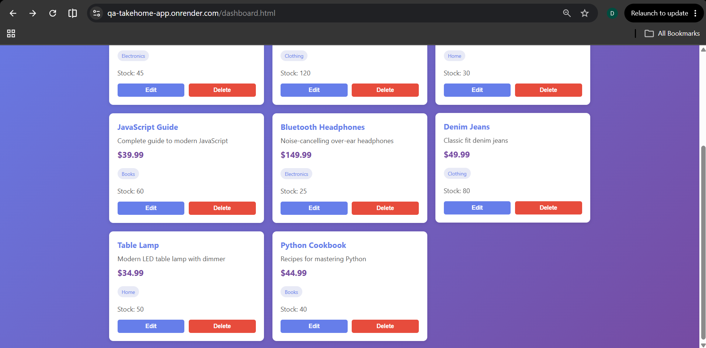

**Figure 2 — Original product remains and a new edited product is created after saving**

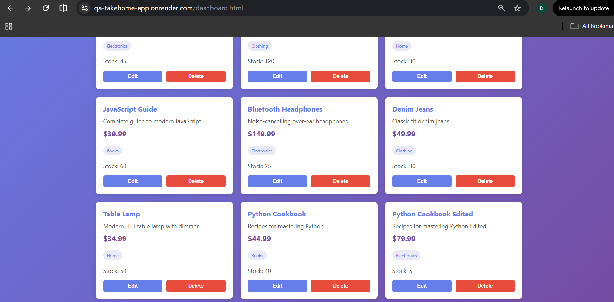

 ## BUG-004 — [Product Deletion] Delete action does not remove the selected product

* **Severity:** High
* **Priority:** High 
* **Status:** Open
 

### Summary

Selecting **Delete** on a product does not remove the selected product from the inventory.

### Description

The product deletion functionality does not complete successfully. After the administrator selects **Delete** for a product and confirms the operation, the product card remains visible in the inventory.

The product also remains available when the inventory is searched, preventing administrators from removing obsolete, duplicated or incorrect records.

### Environment

* **Application:** Product Inventory Application
* **Environment:** QA
* **URL:** `https://qa-takehome-app.onrender.com/dashboard.html`
 

### Preconditions

1. The user is logged in as an administrator.
2. The Product Inventory dashboard is open.
3. A uniquely named test product exists in the inventory.

### Test data

| Field        | Value                                |
| ------------ | ------------------------------------ |
| Product name | `Python Cookbook Edited`                |
| Description  | `Recipes for mastering Python Edited ` |
| Price        | `79.99`                              |
| Category     | `Electronics`                        |
| Stock        | `5`                                  |

### Steps to reproduce

1. Navigate to the Product Inventory dashboard.
2. Locate the `Python Cookbook Edited` product.
3. Select **Delete** on its product card.
4. Select **OK** in the deletion confirmation dialog.
5. Confirm that the product remains visible in the inventory.
6. Enter `Python Cookbook Edited` in the search field.
7. Confirm that the supposedly deleted product still appears in the search results.

### Actual result

The `Python Cookbook Edited` product remains visible in the inventory after
the administrator confirms the deletion.

### Expected result

After the administrator confirms the deletion, the application should:

* Remove the selected product from the inventory.
* Remove its product card from the dashboard.
* Ensure that the product no longer appears in search results.
* Display confirmation that the deletion completed successfully.

### User and business impact

Administrators cannot remove obsolete, duplicated or incorrect products from the inventory. This causes inaccurate inventory records to accumulate and reduces confidence in the product data. The impact is greater when combined with the editing defect that creates duplicate records.

### Evidence
 

**Figure 1 — Python Cookbook Edited exists before deletion**

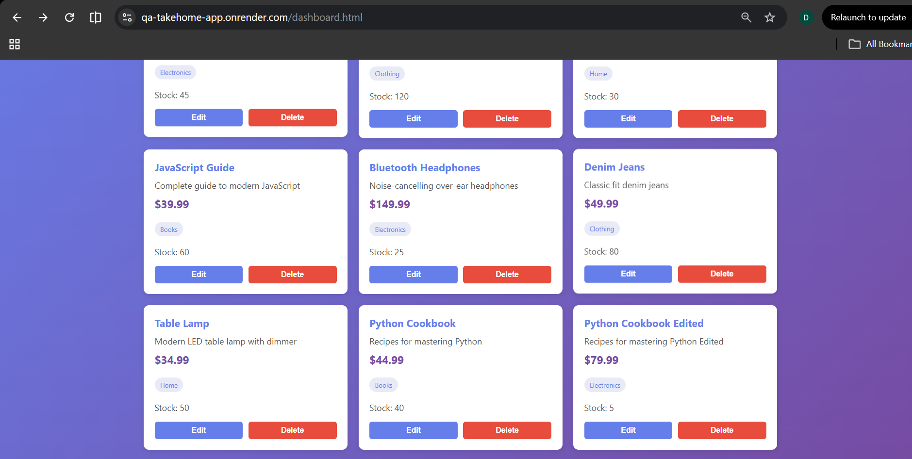

**Figure 2 — Deletion confirmation displayed after selecting Delete**

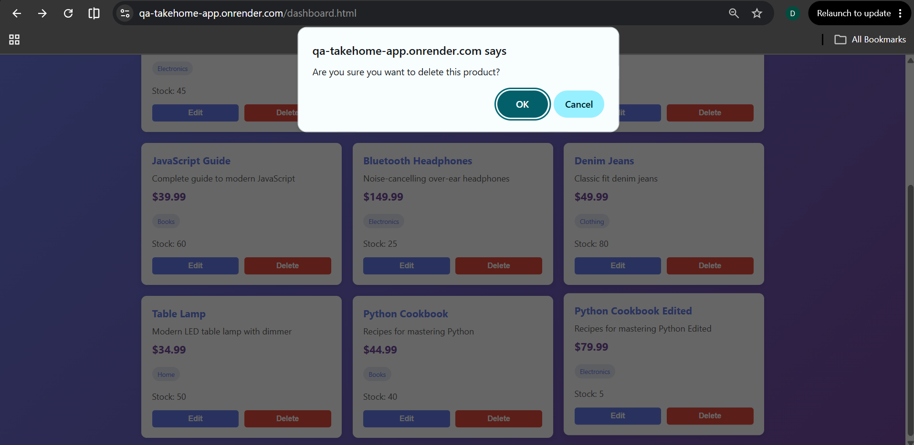

**Figure 3 — Python Cookbook Edited remains after deletion is confirmed**

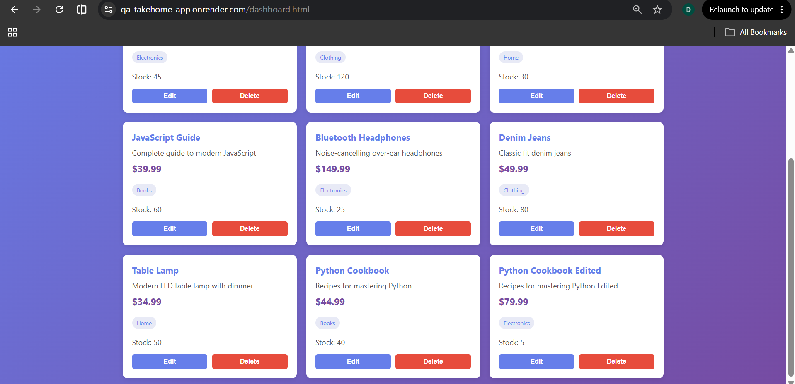

**Figure 4 — Python Cookbook Edited remains in search results after confirmed deletion**

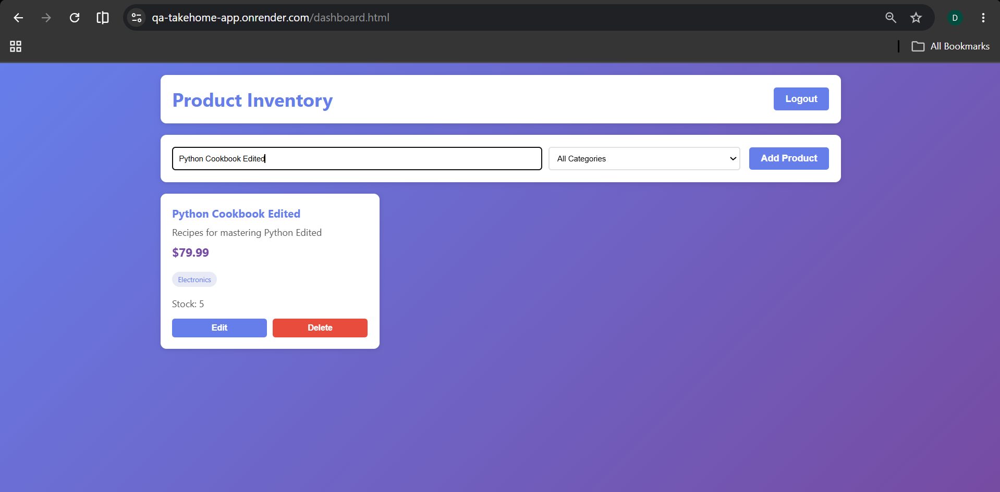

 
## BUG-005 — [Product Validation] Products with negative price and stock values can be saved

* **Severity:** High
* **Priority:** High
* **Status:** Open

### Summary

The application accepts and saves products containing negative price and stock values.

### Description

The Add Product form does not enforce valid minimum values for the Price and Stock fields. An administrator can enter negative numbers, save the form and create a product containing invalid inventory data.

The invalid values remain visible on the product card after the product is saved.

### Environment

* **Application:** Product Inventory Application
* **Environment:** QA
* **URL:** `https://qa-takehome-app.onrender.com/dashboard.html`
 

### Preconditions

1. The user is logged in as an administrator.
2. The Product Inventory dashboard is open.

### Test data

| Field        | Value                                          |
| ------------ | ---------------------------------------------- |
| Product name | `Negative Values Test`                 |
| Description  | `Product created to verify numeric` |
| Price        | `-10.00`                                       |
| Category     | `Electronics`                                  |
| Stock        | `-5`                                           |

### Steps to reproduce

1. Navigate to the Product Inventory dashboard.
2. Select **Add Product**.
3. Enter the values shown in the test-data table.
4. Observe whether validation messages are displayed.
5. Select **Save**.
6. Locate `Negative Values Test` in the inventory.
7. Verify the price and stock displayed on the resulting product card.

### Actual result

The application displays no validation message and allows the product to be
saved. The resulting `Negative Values Test` product card displays a price of
`$-10.00` and a stock quantity of `-5`.

### Expected result

The application should:

* Reject price values below `0.00`.
* Reject stock quantities below `0`.
* Display clear validation messages beside the affected fields.
* Prevent the product from being saved until valid values are entered.
* Ensure that invalid numeric values are not stored or displayed in the inventory.

### User and business impact

Negative prices and stock quantities make the inventory inaccurate and unreliable. Invalid pricing could affect financial calculations, while negative stock values could cause incorrect availability information, reporting errors and poor inventory decisions.

### Evidence

**Figure 1 — Negative price and stock values entered in the Add Product form**

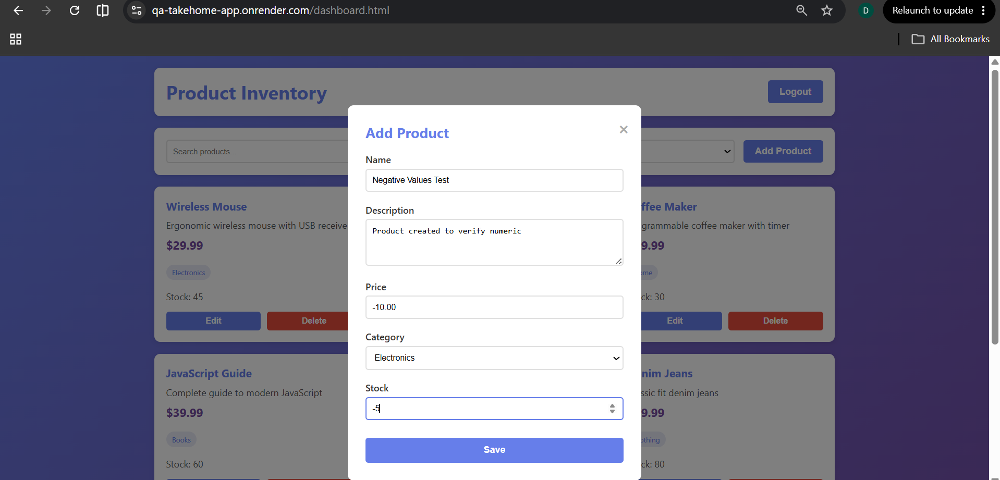

**Figure 2 — Product successfully saved with negative price and stock values**

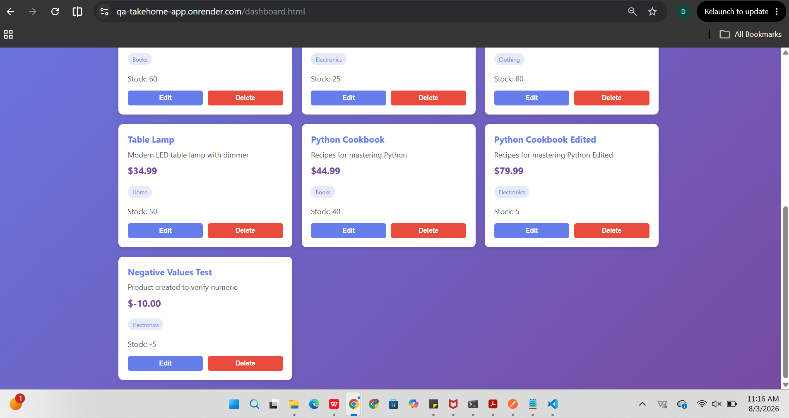

